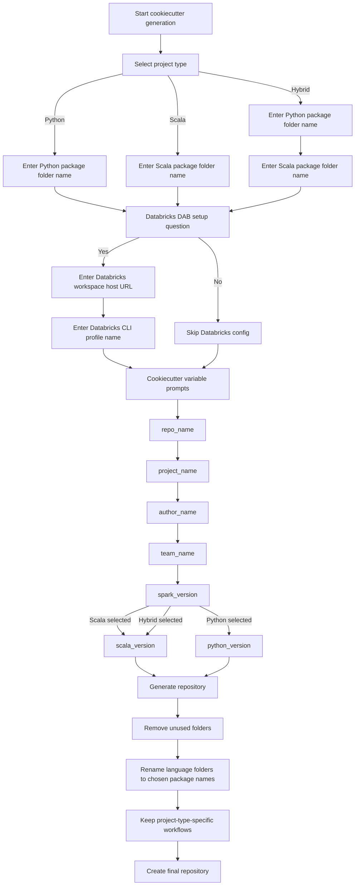

# DNA Consolidated Template Guide

This repository is generated from the DNA consolidated Cookiecutter template. This README is intentionally generic so it works for any repository created from the template, regardless of whether the generated project is Python, Scala, or Hybrid.

The goal of this guide is to help any user understand:

- how to create a repository from the template
- how to work with the generated project locally
- how Databricks Asset Bundle support works
- what choices can be made during the template questionnaire

## Table of Contents

1. [Overview](#overview)
2. [Typical Generated Structure](#typical-generated-structure)
3. [Prerequisites](#prerequisites)
4. [How to Generate a Repository](#how-to-generate-a-repository)
5. [Questionnaire Decision Tree](#questionnaire-decision-tree)
6. [Step-by-Step Usage After Generation](#step-by-step-usage-after-generation)
7. [Makefile Utilities](#makefile-utilities)
8. [Databricks Asset Bundle Usage](#databricks-asset-bundle-usage)
9. [Detailed Example](#detailed-example)

## Overview

The DNA consolidated template is designed to scaffold repositories for Databricks-oriented development with a consistent structure, consistent automation, and standard build commands.

It supports three repository types:

- Python
- Scala
- Hybrid

During generation, the template prompts the user for the basic project details, the package folder names, and whether Databricks Asset Bundle support should be included.

After generation, the template automatically:

- removes unused language folders
- renames the language folders to the names supplied by the user
- optionally includes a ready-to-use `databricks.yml`

## Typical Generated Structure

The exact structure depends on the selected type, but the repository generally looks like this:

```text
repo-root/
  Makefile
  README.md
  databricks.yml                # only when Databricks support is enabled
  .github/
    actions/
      build-and-deploy/
        action.yml
    workflows/
      python-pr-check.yml       # Python or Hybrid
      scala-pr-check.yml        # Scala or Hybrid
  <python-package-folder>/      # Python or Hybrid
    pyproject.toml
    resources/
    src/
  <scala-package-folder>/       # Scala or Hybrid
    build.sbt
    project/
      build.properties
      plugins.sbt
    resources/
    src/
```

## Prerequisites

Install the tools that apply to your project type.

General:

- Git
- Cookiecutter

For Python projects:

- Python 3.11 or later recommended

For Scala projects:

- Java 21
- sbt

For Databricks support:

- Databricks CLI
- a configured Databricks CLI profile on the user machine

## How to Generate a Repository

Run Cookiecutter from the template root.

```bash
cookiecutter dna-consolidated-template
```

During generation, the template prompts for:

- repository name
- project name
- author name
- team name
- Spark version
- project type: Python, Scala, or Hybrid
- package folder name(s)
- whether Databricks Asset Bundle support should be enabled
- Databricks host and Databricks CLI profile if Databricks support is enabled

If Hybrid is selected, the template asks separately for:

- Python package folder name
- Scala package folder name

These names are then used to rename the generated language folders.

## Questionnaire Decision Tree

The following flow chart shows the full questionnaire path and the choices available at generation time.



## Step-by-Step Usage After Generation

Once the repository is created, change into the repository root:

```bash
cd <generated-repository>
```

### Step 1. Set up the project

Run:

```bash
make setup
```

What this does depends on the repository type:

- Python: creates a local virtual environment inside the Python package folder
- Scala: resolves Scala dependencies with sbt in CI-friendly batch mode
- Hybrid: does both

### Step 2. Build the project

Run:

```bash
make build
```

What this does depends on the repository type:

- Python: compiles Python source files
- Scala: runs `sbt compile`
- Hybrid: runs both operations

### Step 3. Run the local CI flow

Run:

```bash
make ci
```

This is the convenience command that runs the standard local CI sequence.

- Without Databricks support: build + test
- With Databricks support: build + test + bundle validation

## Makefile Utilities

The top-level `Makefile` is the main entry point for users.

Common commands:

- `make setup`
- `make build`
- `make test`
- `make ci`

If Databricks support is enabled, the following are also available:

- `make validate`
- `make deploy`

This design keeps the user experience simple and avoids asking users to remember separate command sets for each language.

## Databricks Asset Bundle Usage

If Databricks support was enabled during generation, the repository includes `databricks.yml` and Makefile targets for validation and deployment.

Typical commands:

```bash
make validate
make deploy
```

How it works:

- `databricks.yml` stores the Databricks workspace host
- `Makefile` stores the default Databricks CLI profile
- `make validate` runs bundle validation using the default or supplied profile
- `make deploy` runs bundle deployment using the default or supplied profile

## Detailed Example

Below is a full example of a user generating a Hybrid repository with Databricks support.

### Generation

```text
$ cookiecutter dna-consolidated-template

Select project type:
1 - python
2 - scala
3 - hybrid
Choose [1/2/3]: 3

Enter Python package folder name: py_pkg
Enter Scala package folder name: sc_pkg

Databricks Asset Bundle (DAB) setup:
Do you want to set up Databricks DAB? [y/n]: y
Enter Databricks workspace host URL: https://adb-1234567890123456.7.azuredatabricks.net/
Enter Databricks CLI profile name: dev-public

[1/6] repo_name (dna-sample-service): dna-hybrid-service
[2/6] project_name (DNA Sample Service): DNA Hybrid Service
[3/6] author_name (Your Name): Example User
[4/6] team_name (DPS): DPS
[5/6] spark_version (3.5.0): 3.5.0
[6/6] scala_version (2.12.18): 2.12.18
```

### After generation

```bash
cd dna-hybrid-service
make setup
make build
make test
make validate
```
